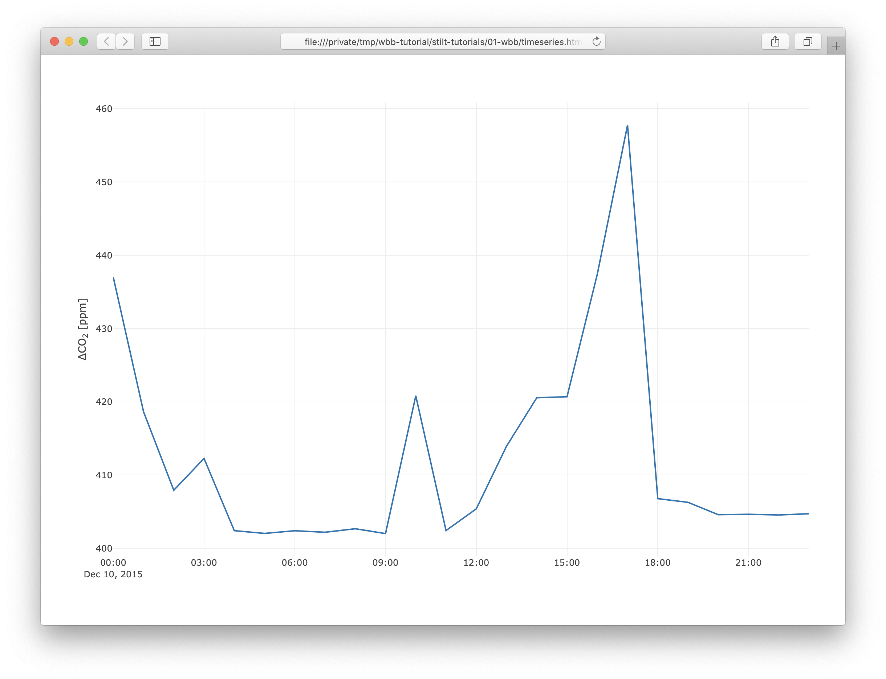
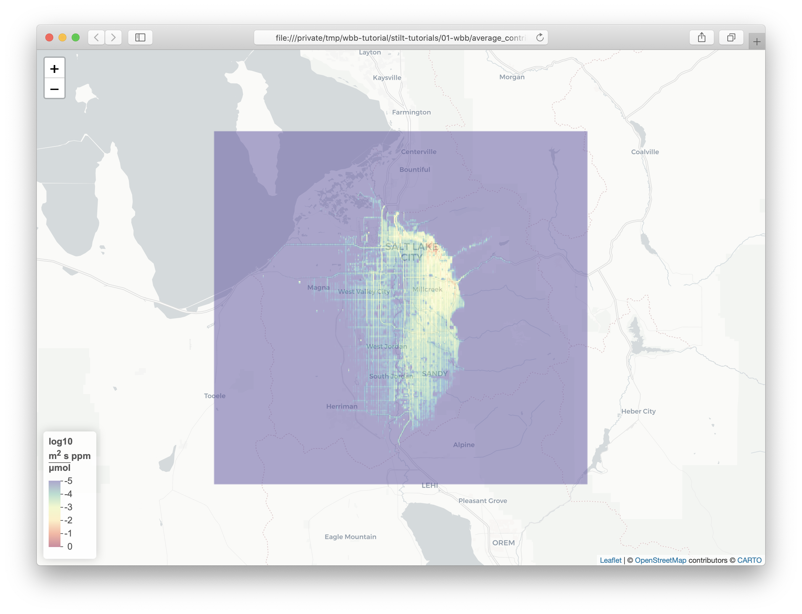

# WBB Carbon Dioxide

Here, we'll simulate a day of carbon dioxide concentrations for the [UATAQ Lab](https://air.utah.edu), housed in the William Browning Building (WBB) on the University of Utah campus. This tutorial assumes a base level of knowledge for [navigating UNIX based filesystems from the command line](https://www.digitalocean.com/community/tutorials/basic-linux-navigation-and-file-management) and know where to find the [model documentation](https://uataq.github.io/stilt/).

## Dependencies

Let's start by ensuring the necessary dependencies are installed.

> Many HPC clusters have begun using [modules](https://www.chpc.utah.edu/documentation/software/modules.php) to manage multiple software environments. To load dependencies using modules, you need to load the `netcdf-c` and `R` modules. You can run `module load netcdf-c R` in your current bash session or add it to the bottom of your shell configuration file (`.bashrc`) to load the dependencies at every login.

We need R version `3.2.5` or higher, which you can find in the output from

```bash
Rscript --version
# R scripting front-end version 4.0.2 (2020-06-22)
```

We also need the NetCDF libraries to be installed. Footprints are saved in compressed NetCDF files, which reduces their file size and stores results with associated metadata so that the output is self documenting. We can check if NetCDF is installed with

```bash
nc-config --all
# This netCDF 4.7.4 has been built with the following features: 
#
#   --cc            -> /usr/local/Homebrew/Library/Homebrew/shims/mac/super/clang
#   --cflags        -> -I/usr/local/Cellar/netcdf/4.7.4_1/include
#   --libs          -> -L/usr/local/Cellar/netcdf/4.7.4_1/lib -lnetcdf
#   --static        -> -lhdf5_hl -lhdf5 -lsz -lz -ldl -lm -lcurl
```

## Project setup

Now that we have the dependencies installed, let's start a new STILT project. We can install this package from Github -

```bash
Rscript -e "install.packages('devtools'); devtools::install_github('benfasoli/uataq')"
```

Then we can initialize our STILT project -

```bash
Rscript -e "uataq::stilt_init('wbb-tutorial', branch='hysplit-merge')"
# Cloning into 'wbb-tutorial'...
# remote: Enumerating objects: 60, done.
# remote: Counting objects: 100% (60/60), done.
# remote: Compressing objects: 100% (56/56), done.
# remote: Total 60 (delta 3), reused 25 (delta 2), pack-reused 0
# Unpacking objects: 100% (60/60), 2.26 MiB | 4.09 MiB/s, done.
# Compiling footprint kernel aggregation subroutine...
#
# STILT installation successful.
#
# Relevant manuscripts:
# 1. Fasoli, B., Lin, J. C., Bowling, D. R., Mitchell, L., and Mendoza, D.: 
#    Simulating atmospheric tracer concentrations for spatially distributed 
#    receptors: updates to the Stochastic Time-Inverted Lagrangian Transport 
#    model's R interface (STILT-R version 2), Geosci. Model Dev., 11, 2813-2824, 
#    [10.5194/gmd-11-2813-2018](https://doi.org/10.5194/gmd-11-2813-2018), 2018.
# 2. Lin, J. C., Gerbig, C., Wofsy, S. C., Andrews, A. E., Daube, B. C., Davis,
#    K. J. and Grainger, C. A.: A near-field tool for simulating the upstream 
#    influence of atmospheric observations: The Stochastic Time-Inverted Lagrangian
#    Transport (STILT) model, J. Geophys. Res., 108(D16), ACH 2-1-ACH 2-17, 
#    [10.1029/2002JD003161](https://doi.org/10.1029/2002JD003161), 2003.
#
# We strongly suggest you subscribe to the critical update notifications at
# https://uataq.github.io/stilt/
# to be notified if important STILT model updates updates.
```

Check to be sure the `hycs_std` and `xtrct_grid` binaries were installed in `wbb-tutorial/exe/`

```bash
cd wbb-tutorial
ls exe
# ASCDATA.CFG  ROUGLEN.ASC  arw2arl  xtrct_grid  LANDUSE.ASC  TERRAIN.ASC  hycs_std 
```

Success! We've now set up our STILT project.

## Fetch tutorial data

The minimum we need to simulate the carbon dioxide concentration at WBB is (1) meteorological data to transport the STILT particles and (2) a near-field emissions inventory. You can download example data for this tutorial in the base directory of your STILT project using

```bash
git clone https://github.com/uataq/stilt-tutorials
ls stilt-tutorials/01-wbb
# emissions.rds met/ tutorial.r
```

which contains

1. `emissions.rds` a 0.002 deg hourly emissions inventory
1. `met/` meteorological data files
1. `tutorial.r` a simple script to combine footprints with the emissions inventory and plot a timeseries of the concentrations

> Want a gold star? Fetch your meteorological data from [NOAA ARL](https://www.ready.noaa.gov/archives.php) to get comfortable with accessing their archives.

## Configuration

We need to configure STILT for our example. Begin by opening `r/run_stilt.r` in a text editor. Unless otherwise described below, leave the simulation settings as their defaults.

Set the simulation timing and receptor location to

```r
# Simulation timing, yyyy-mm-dd HH:MM:SS
t_start <- '2015-12-10 00:00:00'
t_end <- '2015-12-10 23:00:00'
run_times <- seq(from = as.POSIXct(t_start, tz='UTC'),
                 to = as.POSIXct(t_end, tz='UTC'),
                 by = 'hour')

# Receptor locations
lati <- 40.766189
long <- -111.847672
zagl <- 25
```

Next, let's adjust the footprint grid settings so that it uses the same domain as our emissions inventory. Set the footprint grid settings to

```r
xmn <- -112.30
xmx <- -111.52
ymn <- 40.390
ymx <- 40.95
xres <- 0.002
yres <- xres
```

Last, we need to tell STILT where to find the meteorological data files for the sample. Set the `met_path` to

```r
# Meteorological data input
met_path <- file.path(stilt_wd, 'stilt-tutorials', '01-wbb', 'met')
met_file_format <- '%Y%m%d.%H'
```

That's it! We're all set to run the model. From the base directory of our STILT project, run `Rscript r/run_stilt.r` and wait a few minutes for the simulations to complete.

```bash
Rscript r/run_stilt.r
# Initializing STILT
# Number of receptors: 24
# ...
```

## Applying emissions

Now that we have 24 footprints for each hour of our simulation, the next step is to convolve the footprints with our emissions inventory. An example of how to do this can be found in `stilt-tutorials/01-wbb/tutorial.r`, which makes some overly-basic assumptions to calculate the carbon dioxide concentration at the receptor.

To convolve the footprints with emissions estimates -

```bash
cd stilt-tutorials/01-wbb
Rscript tutorial.r
```

which will output `timeseries.html` to the current directory showing the modeled concentrations -



as well as maps for the average footprint (`average_footprint.html`) and average contribution of fluxes over space (`average_contribution.html`) -

Average Footprint | Average CO2 Contribution
------------------|-----------------
  |  

> The boundary of the contributed emissions is the extent of Salt Lake County, which is the area for which the emissions data exists.

---

## Next steps

- [Tutorial: Light-rail simulations](https://github.com/uataq/stilt-tutorials/tree/master/02-train)
