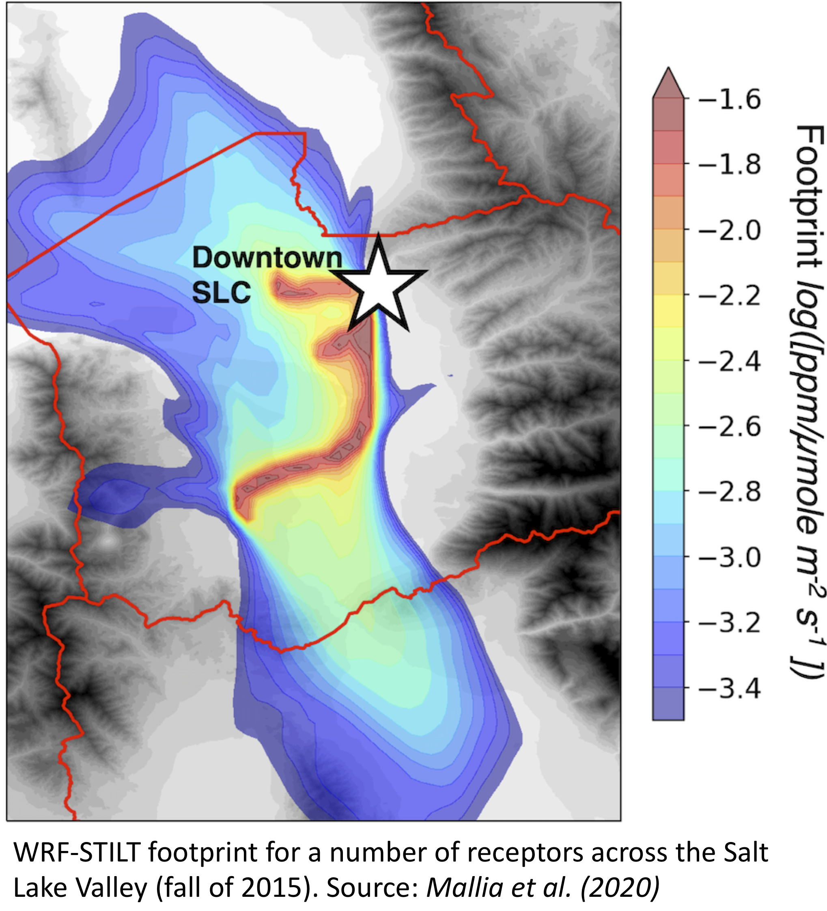
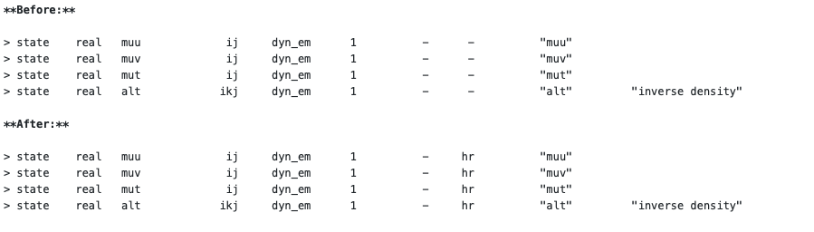

# WRF-STILT tutorial

_Written by Derek V. Mallia, Ben Fasoli, and Chris Loughner_<br>
_Version: January 14th, 2021_



### Preface

If you are reading this tutorial you are likely interested in running HYSPLIT-STILT with model output from the Weather Research and Forecast model (WRF; Skamarock et al. 2008). _First, why WRF-STILT_?

1. While there are a number of meteorological input files out there, many of these analyses have either limited domains and/or spatial resolution. Coarse spatial resolution can limit the ability for STILT to accurately trace air flow in areas with complex terrain and/or fine-scale meteorological circulations. WRF offers a way to downscale coarser-scale meteorology to the resolutions needed to resolve smaller-scale phenomena.
2. Many analyses just do not cover times you are interested. The High-Resolution Rapid Refresh model (HRRR) is a state of the art NWP model that has the grid spacing needed to resolve most mesoscale circulations. However, HRRR has only been operational since 2015. If you want to investigate something before that, you will be out of luck when using HRRR!
3. Model and model analyses have biases. There are just some meteorological phenomena that these analyses struggle with. For example, NWP models have a hard time getting snowpack correct. Across the Intermountain West, this snowpack can be really important driver for persistent cold-pool inversions in mountain-valley basins. Many times, snow depth is a quantity that can be better prescribed in a model like WRF, which may give the model a better chance at resolving persistent cold-pool inversions, which can ultimately impact local transport. Being able to make these type of adjustments might be why someone may want to use WRF.

_However, there are some cavaets..._

1. WRF is not easy to use. If you have a colleague that can run WRF for you, lucky you! In most cases, this is not an option. **This tutorial is not meant to show you how to become a proficient WRF modeler** as this can take months to even years of practice. The most this tutorial will do is show you how to convert output files already generated from WRF and run them with HYSPLIT-STILT. More information on WRF can be found [here!](https://www2.mmm.ucar.edu/wrf/users/)
2. Always look at your model output with a careful eye. Just because WRF ran, does not mean it produced something realistic (most of the time it does, thankfully). Always be sure to evaluate your model data with observations!
3. WRF is awesome, I've built my career around WRF. But running WRF may not make sense for every application. Be sure check out some of the other fantastic meteorological analyses out there and see if they make sense for your application/research! It may not be necessary to re-invent the wheel by running WRF!

If WRF-STILT still makes sense for your application, proceed below!

## Before running WRF

Results in Nehrkorn et al. (2011) showed that mass conversation within STILT can be drastically improved by using time-average winds instead of the instantanous winds, which are provided at the time of the output frame. Essentially, these winds may not be representative of the winds during the entire hour. As a result, we encourage WRF-STILT users to modify the WRF Registry so that time-average winds are added to the WRF output file.

To activate the history output `hr` for the variables needed by the ARL converter, users should change the following lines within `./Registry/Registry.EM_COMMON`:



The following lines should also be added added to the wrf namelist `namelist.input` under the &dynamics section:

```bash
do_avgflx_em = 1, 1, 1, 1, 1, 1, 1, 1, 1,
do_avgflx_cugd = 1, 1, 1, 1, 1, 1, 1, 1, 1,
```

Finally, note that any time a change is made to the WRF Registry, WRF will need to be recompiled.

## The WRF ARL conterter

The `arw2arl` binary converts between the WRF output format and the ARL format compatible with HYSPLIT and STILT.

### Compiling the WRF ARL converter

If you installed STILT v2 using the pre-compiled binaries (recommended), no additional action is needed. The `arw2arl` executable compatible with your operating system can be found in your STILT project at `exe/arw2arl`. If you are this type of user, proceed to [Running the WRF ARL converter](#running-the-wrf-arl-converter).

If you need to compile your HYSPLIT-STILT code from source, you will need to access make additional changes to the `Makefile.inc` by linking netCDF environment paths to the appropriate libraries:

For example:

```bash
NETINC= -I/uufs/chpc.utah.edu/common/home/lin-group12/software/local/include
NETLIBS= -L/uufs/chpc.utah.edu/common/home/lin-group12/software/local/lib -lnetcdff # for netCDF4
```

Once the appropriate paths have been set for `NETINC` and `NETLIBS`, run the following command to compile the arw2arl code:

```bash
(cd data2arl/arw2arl && make)
```

Once the compilation finishes, check the `exec` directory to ensure that the arw2arl executable has been created.

### Running the WRF ARL converter

The next step of this guide is to show you how to run the `arw2arl` code on WRF output files (which should be in NetCDF format). In order to run the ARL converter, you will need 3 files:

1. The ARL converter configuration file `WRFDATA.CFG`
1. WRF output files
   > Files for the tutorial were downloaded during [Project setup](#project-setup) to stilt-tutorials/03-wrf/wrfout
1. The ARL executable `arw2arl`
   > Found at exe/arw2arl in your STILT project

The `WRFDATA.CFG` file is responsible for configuring the ARL converter to run with your WRF input files. Most of the times, this can be left as the default, which has been provided below. However, there are some instances were you may need to make changes to this file, such as using instantaneous winds, TKE variables, and so on. More documentation on how to setup the configuration can be found in [Note-arw2arl.pdf](Note-arw2arl.pdf).

For now, stick with the default `WRFDATA.CFG` file, which has been provided within the repository (top level). This file should be in the same directory that you are running the code from.

In order to run the executable with the file of interest you simply need to execute the `arw2arl` code, followed by the input WRF filename and path `-i`, the name of the file that will be created `-o`, and a flag that specifies the configuration file type that we will be using (`-c1`, `-c2`, or `-c3`). For time-average winds, we use `-c2`. The line that we execute in our terminal line should look something like this:

> ./arw2arl -i$WRF_PATH/$WRF_FILENAME -c2

Note that in this example, we did not specify an output name, thus, the default filename was used `WRFDATA.ARL`.

For cases were you are converting multiple WRF files, feel free to use the shell script provided within this repository `arw2arl_batch.sh` and edit it accordingly.

When running the ARL converter code, you should hopefully see the following lines being printed to your terminal screen:

> Using an existing decoding configuration: WRFDATA.CFG<br>
> Using an existing encoding configuration: ARLDATA.CFG<br>
> NOTICE pakset:<br>
> Number of index records = 1<br>
> Number of records /time = 594<br>
> NOTICE pakini: start initialization rec = 1<br>
> NOTICE pakini: end initialization rec = 594<br>
> Initialized accumulated precip from file: WRFRAIN.BIN<br>
> Completed: 15 9 11 18 0<br>

❗ The numbers printed above will depend on the domain size and date of your WRF simulations ❗

👍 One final tip! If you are using time-averaged winds, not that the first few frames of your WRF simulation _MAY NOT_ have these variables available since these are generally computed as hourly "averages". So be sure to account for this when running your STILT simulations later on. Personally, I usually just toss out the first 3 hours of any WRF simulation since the model needs time to "spin up" mesoscale circulations!

## Tutorial

Let's start a new STILT project using the [uataq R package](https://github.com/benfasoli/uataq). We can initialize our STILT project in our current directory within R using

```bash
Rscript -e "uataq::stilt_init('wrf-tutorial')"
cd wrf-tutorial
```

You can download example data for this tutorial in the base directory of your STILT project using

```bash
git clone --depth=1 https://github.com/uataq/stilt-tutorials
```

Let's also copy the `arw2arl` binary into the tutorial directory.

```
cp exe/arw2arl stilt-tutorials/03-wrf/
```

Your directory tree should look like

```
<PROJECT>
    bin/
        ...
    docs/
        ...
    exe/
        arw2arl
        ...
    r/
        run_stilt.r
        ...
    stilt-tutorials/
        03-wrf/
            wrfout/
                wrfout_*.nc
                ...
            arw2arl
            arw2arl_batch.sh
            ...
    test/
        ...
```

**Step 1)** Change to the WRF tutorial directory and run the shell script: `(cd stilt-tutorials/03-wrf && ./arw2arl_batch.sh)`. Be sure that `WRFDATA.CFG` is located in in the same directory as your script. This will create a directory at `stilt-tutorials/03-wrf/arlout` containing the converted files grouped by day.

**Step 2)** After you have successfully converted the WRF files provided above, edit the `r/run_stilt.r` configuration accordingly. Note that the WRF files provided cover times between `2015-09-05_12:00:00` and `wrfout_d01_2015-09-06_03:00:00`. You will also need to change the names for `met_path` and `met_file_format`. Since this WRF simulation is centered over Salt Lake City, Utah; be sure that the correct receptor location and domain size is selected. The lines lists that lines that you may want to adjust and how.

```r
# Simulation timing, yyyy-mm-dd HH:MM:SS (UTC)
t_start <- '2015-09-06 00:00:00'
t_end   <- '2015-09-06 01:00:00'
run_times <- seq(from = as.POSIXct(t_start, tz = 'UTC'),
                 to = as.POSIXct(t_end, tz = 'UTC'),
                 by = 'hour')

# Receptor location(s)
lati <- 40.740
long <- -111.860
zagl <- 5

# Footprint grid settings, must set at least xmn, xmx, ymn, ymx below
hnf_plume <- T
projection <- '+proj=longlat'
smooth_factor <- 1
time_integrate <- F
xmn <- -114.0
xmx <- -110.99
ymn <- 39.0
ymx <- 42.0
xres <- 0.01
yres <- xres

# Meteorological data input
met_path <- file.path(stilt_wd, 'stilt-tutorials', '03-wrf', 'arlout')
met_file_format <- '%Y-%m-%d'
met_subgrid_buffer <- 0.1
met_subgrid_enable <- F
met_subgrid_levels <- NA
n_met_min <- 1

# Model control
n_hours <- -6
numpar <- 500
rm_dat <- T
run_foot <- T
run_trajec <- T
timeout <- 3600
varsiwant <- c('time', 'indx', 'long', 'lati', 'zagl', 'foot', 'mlht', 'dens',
               'samt', 'sigw', 'tlgr','dmas')
```

**Step 4)** Once you are done editing the `r/run_stilt.r` script, be sure to save it. Then, run the script from your terminal `Rscript r/run_stilt.r`

**Step 5)** If the run was a success, STILT trajectory and footprint files should be located in the out directory `./out`

## Acknowledgements

Before we conclude, the authors would like to acknowledge John C. Lin and Thomas Nehrkorn for their support on WRF-STILT related activities. We would also like to acknowledge [NOAA's Air Resources Laboratory](https://www.arl.noaa.gov) for maintaining the HYSPLIT-STILT model code, and for sharing some of the scripts and configuration files provided here. While the authors are familar with the HYSPLIT-STILT modeling framework, it should be mentioned that we have very busy work schedules and may not be able to immediately respond to every help request.

We would finally like to acknowledge NOAA Climate Program Office’s Atmospheric Chemistry, Carbon Cycle, and Climate program (NA17OAR4310084) for supporting the work here.

## References

Mallia, D. V., L. Mitchell, L. Kunik, B. Fasoli, R. Bares, D. Mendoza, K. Gurney, and J. C. Lin:], 2020:
Constraining urban CO2 emissions using mobile observations derived from a novel light-rail public transit platform. Environ. Sci. & Technol., 54, 24, 15613–15621.

Nehrkorn, T., J. Eluszkiewicz, S. C. Wofsy, J. C. Lin, C. Gerbig, M. Longo, and S. Freitas, 2010: Coupled weather research and forecasting - stochastic time-inverted lagrangian transport (WRF-STILT) model. Meteor. Atmos. Phys., 107 (1), 51-64, doi:10.1007/s00703-010-0068-x.

Skamarock, W. C., J. B. Klemp, J. Dudhia, D. O. Gill, D. Barker, M. G. Duda, J. G. Powers, 2008: A Description of the Advanced Research WRF Version 3 (No. NCAR/TN-475+STR). University Corporation for Atmospheric Research. doi:10.5065/D68S4MVH
